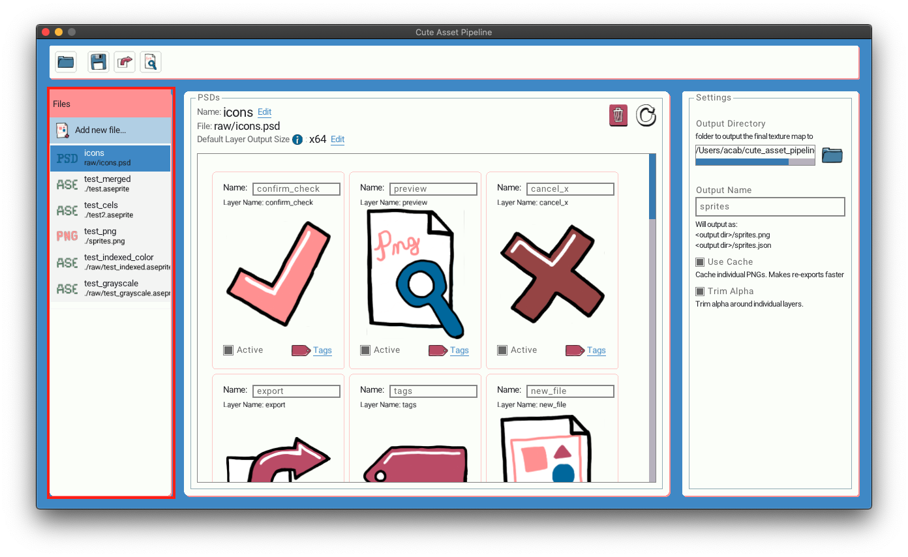
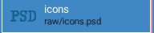
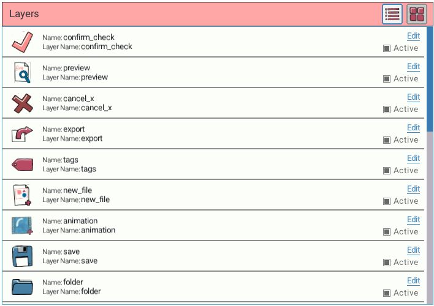

# Assets

Assets are your PNG, PSD, Aseprite files. Sometimes referred to as Raw Assets as well.

The list of assets in your project is on the left hand sidebar.

Each asset also has an icon denoting the file its file type.

## Refreshing an asset
If you edit your asset while Cute Exporter is open. You can refresh Cute Exporter to show the new changes. Click the Refresh icon in the top right of the asset detail view. 

## Removing an asset
You can remove an asset from your project. Click the trash can icon in the top right of the asset detail view. A confirmation modal will pop up. Click `Remove File` to confirm and remove the file from your project.



This action will NOT delete the file on disk. IT only removes it from the list of assets in your project.



## Asset Settings

You can view these settings in the GUI just above the list of layers in the asset

### Name
Name of the Asset. Not currently exported into the JSON file useful for your own reference
### Default Layer Output Size
The output size is the size the exporter will resize your layers to when placing them into the texture atlas. Setting this value will apply the same resizing to each layer in the asset _**if that layer does not have an output size set on it already.**_

Output size can be defined in a few different way.s

* A percentage e.g. `75%`.
* Width and height e.g `200x300`.
* Just width or just height this will preserve aspect ratio 
    * Examples:
    * `x200` will make the height 200px and the width will be resized to the correct aspect.
    * `200x` will make the width 200px and the height will be resized to the correct aspect.

## File specific asset settings.
Different file types have additional settings.

### Aseprite
#### Merge layers
This checkbox will set if all the layers  in a frame (Aseprite calls this a cel) should be merged into a single image. If unchecked each cel in each frame will be output as an individual image.

##### Merged Layers

##### Non-Merged Layers

## Layers
Below the information about the asset is a list of its layers. You can show the layers in a grid or list view. (A PNG or ASE merged layers asset only show a single layer.)

[Read more on individual layers here.]()

### Grid View

### List View

In list view you can hover over a layer preview image to see it larger.

