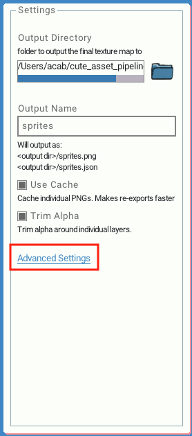

# Project Settings

There are some configurable settings for the app. You can change the settings on the right hand sidebar.

## Output Directory
This is the folder your final exported assets will output to.

It is saved relative to the folder your project file is saved in.

By default the output directory will be the same folder your project is saved in.

Click on the folder icon to change the output directory.

## Output Name
This is the name of the output file your texture and JSON files will be saved as. It will be saved to the output directory.
Changing this value will change the name for the PNG and JSON file.

By default the name of these files is `assets`

## Use Cache

By default Cute Exporter caches individual PNG files into a folder named `cache`. This folder is in the same folder as your project file. If you have many files in your project the cache should increase the speed of re-exports because only the files that have changed since the last export will need to be read.

If you want all your layers as individual PSDs, you can also look into the cache folder for them. They are named by their asset id. i.e `<asset_id>.png`. This will be configurable in the future.

If you don't want to cache any files at all uncheck this box.

If you want a full clean re-export. Delete this folder. It will be remade.

## Trim Alpha

Cute Exporter can trim the extra alpha around your layers. This will lead to your texture atlas being more compact. There are some cases where you may not want this behavior and can uncheck this box.

## Advanced Settings

There are settings that may not be useful for some use cases but can really help with certain workflows.

### Custom Template Script

If you want to output your data differently or in a different format other than json. You can specify your own Lua script to run to have total control over the output.

To start click `Advanced Settings` make sure to check the box `Use a custom Lua script`. You can then select a Lua file that will be run.

#### Lua script specification

After the texture has been packed and all the export metadata is known Cute Exporter will call your script. 
Cute Exporter looks for a function called `onExport` in your Lua script. Cute Exporter will pass a data structure containing all the data that would be exported to json. The data will be a Lua table with the exact same names and layout as the default json output. 

The `doExport` function should return a string. The returned string will be directly saved to the output data file.

The Lua script has full access and power to do anything Lua can do.

Cute Exporter uses a Lua script internally by default to export to json.


#### Custom file extension

When you export your own custom format you likely want to have a custom file extension rather than `.json`. You can specify your own file extension that Cute Exporter should use in your custom export script. Supply a global variable named `outputFileExt`. The file extension should not start with a period (`.`).

When you set a custom file extension in your Lua script it will show up in the settings sidebar.

#### Full Example

This is a simple full example that will simply save "hello!" to the output data file and uses the custom file extension `custom`

outputFileExt = "custom"
function doExport(data) 
	return "hello!"
end
